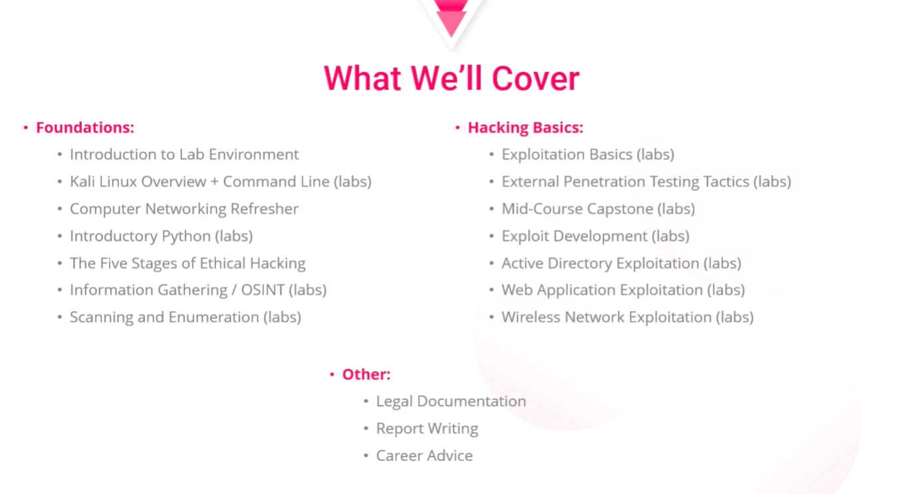

# Introduction

**Date:** 2024-MM-DD  
**Author:** Alberto Diéguez

---

## Table of Contents
- [Course Introduction](#course-introduction)
- [Course Discord](#course-discord)
- [A Day in the Life of an Ethical Hacker](#a-day-in-the-life-of-an-ethical-hacker)
- [Why You Shouldn't be an Ethical Hacker](#why-you-shouldnt-be-an-ethical-hacker)
- [Section Quiz](#section-quiz)

---

## Course Introduction
Heath Adams - Boss of TCM Security 
- Social Media: 
  - [LinkedIn](https://linkedin.com/in/heathadams )
  - [Twitter](https://x.com/tcmsecurity)
  - [YouTube](https://youtube.com/thecybermentor)
  - [Twitch](https://twitch.tv/thecybermentor)

- TCM Sites:
  - [TCM Security](https://tcm-sec.com)
  - [TCM Academy](https://academy.tcm-sec.com)
  - [TCM Certifications](https://certifications.tcm-sec.com)
  - [TCM Exams](https://exams.tcmsecurity.com)

---
## Course Discord
[Course Discord](https://discord.gg/tcm)

---

## A Day in the Life of an Ethical Hacker
Assessment:
 - **External Network Pentest**:
 Assessing an organization's security from outside looking in. Based on OSINT (Open-Source Intelligence) Example: Who are their employees? What is their email format? Usually from 32h to 40h and 8h to 16h for the report.

 - **Internal Network Pentest**:
 Assessing an organization's security from inside of the network. Focuses on Active Directory attacks. Usually from 32h to 40h and 8h to 16h for the report.

 - **Web Application Pentest**:
 Assessing an organization's web application security. Focuses on web-based attacks and OWASP (Open Web Application Security Project). Usually from 32h to 40h and 8h to 16h for the report.

- **Wireless Pentest**:
Assessing an organization's wireless network security. Based on guest vs WPA2-PSK vs WPA2 Enterprise. Usually 4h to 8h per SSID and 2h to 4h for the report.

*Recomended Wireless Adapter*

| Category          | Choice            |
|-------------------|-------------------|
| Best Budget       | Alfa AWUS036ACS   |
| Best Low Profile  | Panda PAU05       |
| Most Balanced     | Alfa AWUS036ACHM  |
| Best Performance  | ASUS USB-AC68     |
| Most Modern       | Alfa AWUS1900     |
| Our Favorite      | Alfa AWUS036ACH   |

- **Physical Pentest & Social Engineering**:
Assessing an organization's physical security and/or end-user training. Usually 16h to 40h and 4h to 8h for the report.

---

## Why You Shouldn't be an Ethical Hacker
You have to like it since you have to stay up to date and study continuously, otherwise you will be left behind. It is a difficult field. You have to learn to write good reports, it's a big part of the job. You have to be a good communicator.

---

## Section Quiz
- **What is ethical hacking?**

  - Car hacking
  - Exploiting network vulnerabilities
  - Breaking into wireless networks
  - Exploiting a vulnerability in a web application
  - [x] All of the above, with permission

- **Following an assessment, what’s the next step of a pentester’s job?**
  - Giving a debrief
  - [x] Writing a report
  - Nothing - the work is complete

- **An external pentest is…**
  - [x] An assessment carried out from outside the organization or network
  - An assessment carried out where data is exfiltrated to outside the network
  - An assessment where only phishing is conducted

- **An external pentest heavily relies on open-source intelligence (OSINT) gathering.**
  - [x] True
  - False

- **An internal pentest is…**
  - An assessment of an organization’s ability to prevent attackers from reaching the internal network
  - An assessment of an organization’s web applications used by customers
  - [x] An assessment of an organization’s security from inside the network

- **Internal pentests focus heavily on…**
  - Social engineering attacks (e.g. phishing)
  - [x] Active directory attacks
  - Preventing users from accessing internal services such as printers, intranet site, and email (Denial of Service)

- **Which guideline can we use for web application penetration testing?**
  - PTES - Penetration testing execution standard
  - [x] OWASP Web Security Testing Guide
  - OSINT - Open Source Intelligence

- **Wireless pentests focus on…**
  - [x] Assessing an organization’s wireless network security
  - Assessing an organization’s internet connectivity speeds
  - Assessing an organization’s ability to work remotely

- **Physical pentests can be conducted remotely over the internet.**
  - True
  - [x] False
