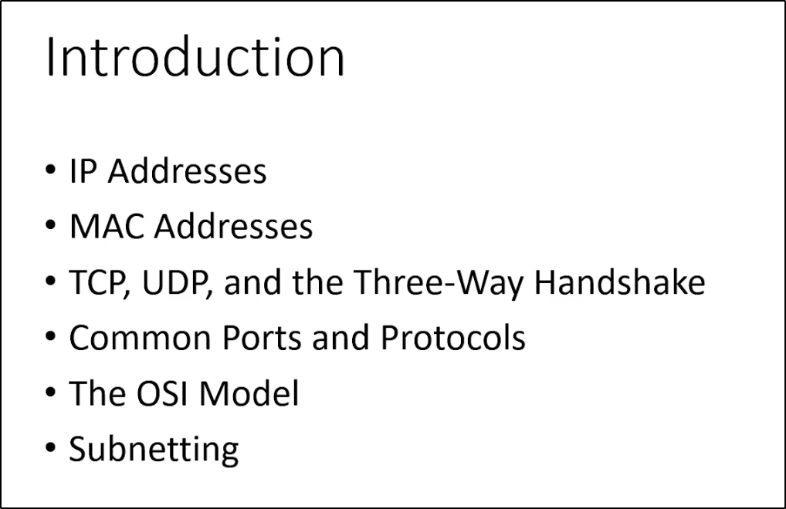
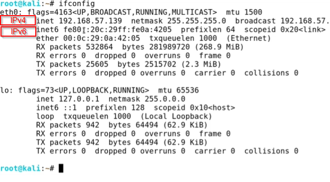
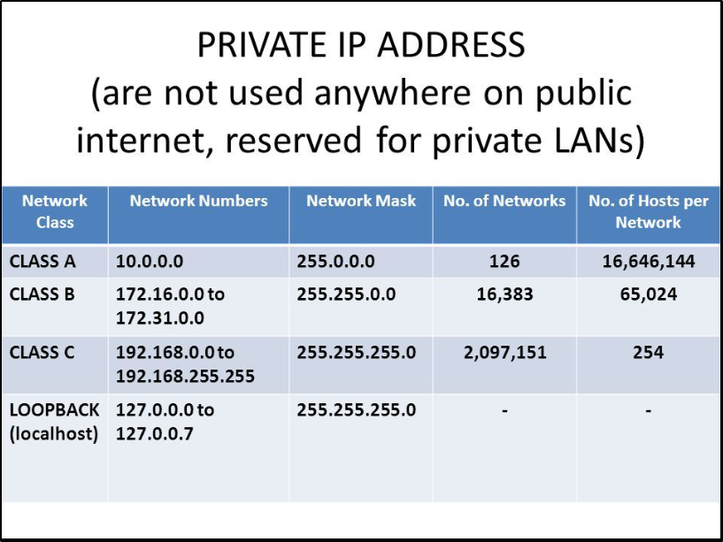

# Note Title

**Date:** 2024-MM-DD  
**Author:** Alberto Diéguez

---

## Table of Contents
- [Introduction](#introduction)
- [IP Addresses](#ip-addresses)
- [MAC Addresses](#mac-addresses)
- [Action Items](#action-items)
- [Table](#table)
- [References](#references)

---

## Introduction

---

## IP Addresses
IPv4 (Internet Protocol version 4) and IPv6 (Internet Protocol version 6) are two versions of the Internet Protocol, which is the underlying protocol that enables communication on the internet. They are used to identify and locate devices on a network.

IPv4 addresses are 32-bit numerical addresses represented in a dotted-decimal format, such as "192.168.0.1". Each section, or octet, of the address consists of 8 bits and can range from 0 to 255. This allows for a total of approximately 4.3 billion unique addresses. However, due to the rapid growth of the internet, the number of available IPv4 addresses has become limited, leading to the development of IPv6.

IPv6 addresses are 128-bit addresses represented in a hexadecimal format, such as "2001:0db8:85a3:0000:0000:8a2e:0370:7334". The longer address length of IPv6 allows for a significantly larger number of unique addresses, approximately 3.4×10^38. IPv6 addresses are divided into eight groups of four hexadecimal digits, separated by colons. Leading zeros within a group can be omitted, and consecutive groups of zeros can be represented by a double colon (::) to simplify the address.

The transition from IPv4 to IPv6 is necessary due to the depletion of available IPv4 addresses. IPv6 provides a solution to the address shortage while also introducing improvements in security, auto-configuration, and other features. However, IPv4 and IPv6 are not directly compatible, so various mechanisms and transition technologies exist to enable communication between the two protocols.

In summary, IPv4 and IPv6 are versions of the Internet Protocol that provide unique addresses to devices on a network. IPv4 addresses are 32-bit, while IPv6 addresses are 128-bit. IPv6 offers a larger address space and additional features compared to IPv4.
**IPv4 and IPv6 are in layer 3 (Network).**

 - IP Address and Subnet Mask in Decimal and Binary 

 Total IPv4: 2^32 = 4.294.967.296

 Total IPv6: 2^128 = 340.282.366.920.938.463.463.374.607.431.768.211.456

Explanation
IP Address (192.168.1.3): This is represented in both decimal and binary format.
Subnet Mask (255.255.255.0): This is the mask that determines the network and host portions of the address.

128 64 32 16 8 4 2 1 = 255

|               | 128 | 64 | 32 | 16 | 8  | 4  | 2  | 1  | Decimal |
|---------------|-----|----|----|----|----|----|----|----|---------|
| **1st Octet** | 1   | 1  | 0  | 0  | 0  | 0  | 0  | 0  | 192     |
| **2nd Octet** | 1   | 0  | 1  | 0  | 1  | 0  | 0  | 0  | 168     |
| **3rd Octet** | 0   | 0  | 0  | 0  | 0  | 0  | 0  | 1  | 1       |
| **4th Octet** | 0   | 0  | 0  | 0  | 0  | 0  | 1  | 1  | 3       |
| **Subnet 1st Octet** | 1   | 1  | 1  | 1  | 1  | 1  | 1  | 1   | 255   |
| **Subnet 2nd Octet** | 1   | 1  | 1  | 1  | 1  | 1  | 1  | 1   | 255   |
| **Subnet 3rd Octet** | 1   | 1  | 1  | 1  | 1  | 1  | 1  | 1   | 255   |
| **Subnet 4th Octet** | 0   | 0  | 0  | 0  | 0  | 0  | 0  | 0   | 0   |

 

---

## MAC Addresses
A MAC (Media Access Control) address is a unique identifier assigned to network interface controllers (NICs) of network devices. It is a hardware address that is permanently assigned by the manufacturer and is stored in the device's firmware or read-only memory (ROM). MAC addresses are used at the data link layer of the OSI model to ensure that data is delivered to the correct device within a local network.

MAC addresses are typically 48 bits in length and are expressed as a sequence of six pairs of hexadecimal digits separated by colons or hyphens. For example, a MAC address may look like "00:1A:2B:3C:4D:5E". The first three pairs of digits identify the manufacturer of the network interface card, while the last three pairs provide a unique identifier for the specific device.

MAC addresses play a crucial role in Ethernet networks, as they allow devices to communicate with each other within a local area network (LAN). When data is sent from one device to another on the same network, it is encapsulated within Ethernet frames that contain the source and destination MAC addresses. Routers and switches use these MAC addresses to forward the data to the appropriate destination.

It's important to note that MAC addresses are specific to the local network and do not have global uniqueness like IP addresses. They are only relevant within the scope of the local network segment. When data needs to be transmitted beyond the local network, it is encapsulated in network packets that contain source and destination IP addresses.

In summary, a MAC address is a unique identifier assigned to the network interface controller of a device. It is used at the data link layer to facilitate communication within a local network. MAC addresses are hardware-based, manufacturer-specific, and differ from IP addresses, which are used for network communication on a larger scale. **MAC Addres is in layer 2 (Data Link).**

### Subheading 1
Detailed information, explanations, or examples related to the key points.

### Subheading 2
Additional information or expanded details as needed.

---

## Action Items
- [ ] **Action 1:** Description of what needs to be done.
- [ ] **Action 2:** Description of what needs to be done.

---

## Table
| Header 1    | Header 2    | Header 3    |
|-------------|-------------|-------------|
| Row 1, Col 1| Row 1, Col 2| Row 1, Col 3|
| Row 2, Col 1| Row 2, Col 2| Row 2, Col 3|
| Row 3, Col 1| Row 3, Col 2| Row 3, Col 3|

---

## References
- [Reference 1](URL): Description of the reference.
- [Reference 2](URL): Description of the reference.

---

## Summary
Summarize the main takeaways from the notes.

---

**Notes:**
- Any additional comments or observations.
