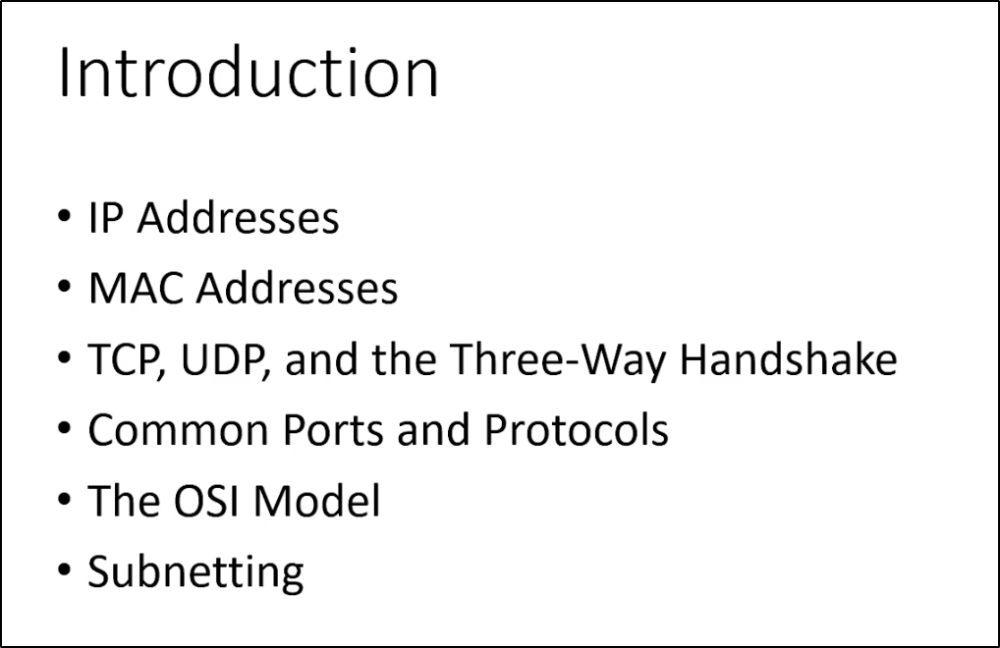
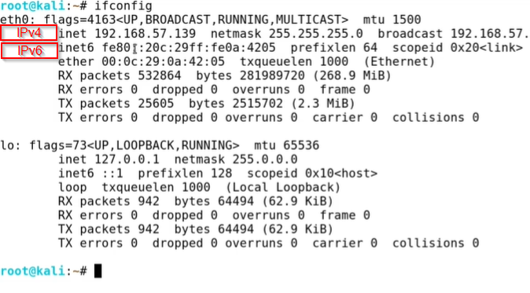
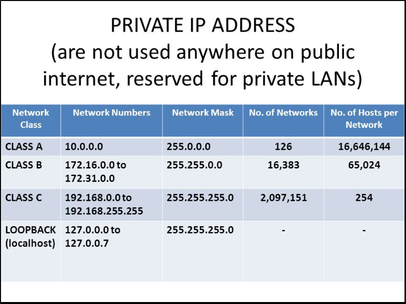
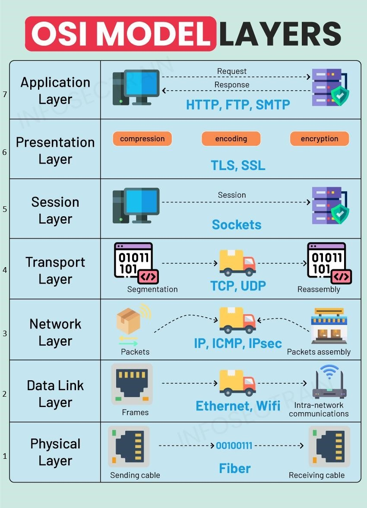

# Note Title

**Date:** 2024-MM-DD  
**Author:** Alberto Diéguez

---

## Table of Contents
- [Introduction](#introduction)
- [IP Addresses](#ip-addresses)
- [MAC Addresses](#mac-addresses)
- [TCP, UDP, and the Three-Way Handshake](#tcp-udp-and-the-three-way-handshake)
- [Common Ports and Protocols](#common-ports-and-protocols)
- [The OSI Model](#the-osi-model)
- [Subnetting Part 1](#subnetting-part-1)

---

## Introduction

---

## IP Addresses
IPv4 (Internet Protocol version 4) and IPv6 (Internet Protocol version 6) are two versions of the Internet Protocol, which is the underlying protocol that enables communication on the internet. They are used to identify and locate devices on a network.

IPv4 addresses are 32-bit numerical addresses represented in a dotted-decimal format, such as "192.168.0.1". Each section, or octet, of the address consists of 8 bits and can range from 0 to 255. This allows for a total of approximately 4.3 billion unique addresses. However, due to the rapid growth of the internet, the number of available IPv4 addresses has become limited, leading to the development of IPv6.

IPv6 addresses are 128-bit addresses represented in a hexadecimal format, such as "2001:0db8:85a3:0000:0000:8a2e:0370:7334". The longer address length of IPv6 allows for a significantly larger number of unique addresses, approximately 3.4×10^38. IPv6 addresses are divided into eight groups of four hexadecimal digits, separated by colons. Leading zeros within a group can be omitted, and consecutive groups of zeros can be represented by a double colon (::) to simplify the address.

The transition from IPv4 to IPv6 is necessary due to the depletion of available IPv4 addresses. IPv6 provides a solution to the address shortage while also introducing improvements in security, auto-configuration, and other features. However, IPv4 and IPv6 are not directly compatible, so various mechanisms and transition technologies exist to enable communication between the two protocols.

In summary, IPv4 and IPv6 are versions of the Internet Protocol that provide unique addresses to devices on a network. IPv4 addresses are 32-bit, while IPv6 addresses are 128-bit. IPv6 offers a larger address space and additional features compared to IPv4.
**IPv4 and IPv6 are in layer 3 (Network).**

 - IP Address and Subnet Mask in Decimal and Binary 

 Total IPv4: 2^32 = 4.294.967.296

 Total IPv6: 2^128 = 340.282.366.920.938.463.463.374.607.431.768.211.456

Explanation
IP Address (192.168.1.3): This is represented in both decimal and binary format.
Subnet Mask (255.255.255.0): This is the mask that determines the network and host portions of the address.

128 64 32 16 8 4 2 1 = 255

|               | 128 | 64 | 32 | 16 | 8  | 4  | 2  | 1  | Decimal |
|---------------|-----|----|----|----|----|----|----|----|---------|
| **1st Octet** | 1   | 1  | 0  | 0  | 0  | 0  | 0  | 0  | 192     |
| **2nd Octet** | 1   | 0  | 1  | 0  | 1  | 0  | 0  | 0  | 168     |
| **3rd Octet** | 0   | 0  | 0  | 0  | 0  | 0  | 0  | 1  | 1       |
| **4th Octet** | 0   | 0  | 0  | 0  | 0  | 0  | 1  | 1  | 3       |
| **Subnet 1st Octet** | 1   | 1  | 1  | 1  | 1  | 1  | 1  | 1   | 255   |
| **Subnet 2nd Octet** | 1   | 1  | 1  | 1  | 1  | 1  | 1  | 1   | 255   |
| **Subnet 3rd Octet** | 1   | 1  | 1  | 1  | 1  | 1  | 1  | 1   | 255   |
| **Subnet 4th Octet** | 0   | 0  | 0  | 0  | 0  | 0  | 0  | 0   | 0   |

 

---

## MAC Addresses
A MAC (Media Access Control) address is a unique identifier assigned to network interface controllers (NICs) of network devices. It is a hardware address that is permanently assigned by the manufacturer and is stored in the device's firmware or read-only memory (ROM). MAC addresses are used at the data link layer of the OSI model to ensure that data is delivered to the correct device within a local network.

MAC addresses are typically 48 bits in length and are expressed as a sequence of six pairs of hexadecimal digits separated by colons or hyphens. For example, a MAC address may look like "00:1A:2B:3C:4D:5E". The first three pairs of digits identify the manufacturer of the network interface card, while the last three pairs provide a unique identifier for the specific device.

MAC addresses play a crucial role in Ethernet networks, as they allow devices to communicate with each other within a local area network (LAN). When data is sent from one device to another on the same network, it is encapsulated within Ethernet frames that contain the source and destination MAC addresses. Routers and switches use these MAC addresses to forward the data to the appropriate destination.

It's important to note that MAC addresses are specific to the local network and do not have global uniqueness like IP addresses. They are only relevant within the scope of the local network segment. When data needs to be transmitted beyond the local network, it is encapsulated in network packets that contain source and destination IP addresses.

In summary, a MAC address is a unique identifier assigned to the network interface controller of a device. It is used at the data link layer to facilitate communication within a local network. MAC addresses are hardware-based, manufacturer-specific, and differ from IP addresses, which are used for network communication on a larger scale. **MAC Addres is in layer 2 (Data Link).**

---

## TCP, UDP, and the Three-Way Handshake

TCP (Transmission Control Protocol) and UDP (User Datagram Protocol) are two commonly used transport layer protocols in computer networks.

TCP is a connection-oriented protocol that provides reliable, ordered, and error-checked delivery of data packets over an IP network. It guarantees that data sent from one device is received correctly by the destination device. TCP achieves this reliability through mechanisms like acknowledgement, retransmission, and flow control. It breaks data into smaller packets, assigns sequence numbers to them, and ensures they are reassembled correctly at the receiving end. TCP is widely used for applications that require guaranteed delivery, such as web browsing, email, file transfer, and remote login.

UDP, on the other hand, is a connectionless protocol that does not provide the same level of reliability as TCP. It is simpler and more lightweight, making it suitable for applications that can tolerate some data loss or delay. UDP does not establish a connection or guarantee delivery of packets. It simply sends data packets from one device to another without waiting for acknowledgements or retransmissions. UDP is commonly used for real-time applications like streaming media, online gaming, DNS (Domain Name System), and VoIP (Voice over IP).

The three-way handshake is a process used by TCP to establish a connection between two devices. It is a sequence of three steps that takes place before data transmission can begin. Here's how the three-way handshake works:

 - SYN (Synchronize): The initiating device (often referred to as the client) sends a TCP packet with the SYN flag set to the destination device (often referred to as the server). This packet indicates the desire to establish a connection and includes an initial sequence number.

 - SYN-ACK (Synchronize-Acknowledge): Upon receiving the SYN packet, the destination device responds with a TCP packet that has both the SYN and ACK (acknowledge) flags set. This packet acknowledges the receipt of the initial SYN packet and also includes its own initial sequence number.

 - ACK (Acknowledge): Finally, the initiating device acknowledges the SYN-ACK packet by sending an ACK packet back to the destination. This packet confirms the establishment of the connection and typically contains an incremented sequence number.

Once the three-way handshake is complete, the connection is established, and both devices are ready to exchange data. The sequence numbers exchanged during the handshake are used to ensure that data is transmitted and received in the correct order.

In summary, TCP is a reliable, connection-oriented protocol that guarantees delivery of data, while UDP is a simpler, connectionless protocol that does not provide the same level of reliability. The three-way handshake is a process used by TCP to establish a connection between devices, involving the exchange of SYN, SYN-ACK, and ACK packets.

---

## Common Ports and Protocols

Here are some commonly used ports and the protocols associated with them in computer networking:

 - FTP (File Transfer Protocol): Port 21 (TCP)
 - SSH (Secure Shell): Port 22 (TCP)
 - Telnet: Port 23 (TCP)
 - SMTP (Simple Mail Transfer Protocol): Port 25 (TCP)
 - DNS (Domain Name System): Port 53 (TCP and UDP)
 - HTTP (Hypertext Transfer Protocol): Port 80 (TCP)
 - HTTPS (Hypertext Transfer Protocol Secure): Port 443 (TCP)
 - DHCP (Dynamic Host Configuration Protocol): Port 67 (UDP) and Port 68 (UDP)
 - POP3 (Post Office Protocol version 3): Port 110 (TCP)
 - IMAP (Internet Message Access Protocol): Port 143 (TCP)
 - SNMP (Simple Network Management Protocol): Port 161 (UDP)
 - RDP (Remote Desktop Protocol): Port 3389 (TCP)
 - NTP (Network Time Protocol): Port 123 (UDP)
 - SMB (Server Message Block): Port 445 (TCP)
 - FTPS (FTP over SSL/TLS): Port 990 (TCP)
 - TFTP (Trivial File Transfer Protocol): Port 69 (UDP)
 - LDAP (Lightweight Directory Access Protocol): Port 389 (TCP and UDP)
 - MySQL: Port 3306 (TCP)
 - RDP (Remote Desktop Protocol): Port 3389 (TCP)

Please note that some protocols use both TCP and UDP, depending on the specific functionality and requirements. Additionally, these port assignments are not exhaustive, and other applications and services may use different ports as well.

---

## The OSI Model

Please
Do
Not
Throw
Sausage
Pizza
Away

The OSI (Open Systems Interconnection) model is a conceptual framework that standardizes the functions of a communication system into seven distinct layers. Each layer has specific responsibilities and interacts with the layers above and below it. The OSI model provides a structured approach to understanding and designing network protocols and communication systems. Here's a brief overview of each layer:

 1. Physical Layer: The physical layer is responsible for the transmission and reception of raw unstructured data bits over a physical medium. It defines the electrical, mechanical, and functional characteristics of the physical interface between devices. Data cables...
 2. Data Link Layer: The data link layer handles the reliable transmission of data frames between directly connected nodes over a physical link. It provides error detection and correction, flow control, and handles access to the physical medium. Ethernet, Wi-Fi, and PPP (Point-to-Point Protocol) are examples of data link layer protocols. Mac addresses...
 3. Network Layer: The network layer enables the routing of data packets across different networks. It deals with logical addressing and determines the best path for data delivery based on network conditions and routing protocols. The IP (Internet Protocol) is a key network layer protocol.
 4. Transport Layer: The transport layer ensures the reliable and orderly delivery of data between end systems. It breaks data into smaller segments, manages end-to-end communication, and provides error recovery, flow control, and congestion control. TCP (Transmission Control Protocol) and UDP (User Datagram Protocol) operate at this layer.
 5. Session Layer: The session layer establishes, manages, and terminates communication sessions between applications. It provides synchronization and dialog control mechanisms to enable seamless communication between devices. This layer also handles session checkpointing and recovery.
 6. Presentation Layer: The presentation layer is responsible for data representation, encryption, compression, and formatting. It ensures that data sent by the application layer of one system is understandable by the application layer of another system. This layer deals with data syntax and semantics. JPEG, MOV...
 7. Application Layer: The application layer is the closest layer to the end-user and provides services directly to user applications. It includes protocols for various application-level services such as file transfer, email, web browsing, and remote access. Examples of protocols at this layer include HTTP, SMTP, FTP, and DNS. HTTP, SMTP...

The key idea behind the OSI model is to separate the complex task of network communication into manageable layers, with each layer focused on specific functions. This modular approach facilitates interoperability, ease of implementation, and troubleshooting in network systems.

It's important to note that the OSI model is a conceptual model and does not necessarily reflect the exact implementation of all networking systems, which often use a hybrid of various layers and protocols. However, the OSI model remains a useful reference for understanding network communication and protocols.

## Subnetting Part 1

### Resources for this Video

- [Seven Second Subnetting](https://www.youtube.com/watch?v=ZxAwQB8TZsM)
- [Subnet Guide](https://drive.google.com/file/d/1ETKH31-E7G-7ntEOlWGZcDZWuukmeHFe/view)

### Subnetting

Subnetting is the process of dividing a network into smaller subnetworks called subnets. It allows for more efficient use of IP addresses and facilitates network management and routing. Subnetting is commonly used in IPv4 networks.

Subnetting involves borrowing bits from the host portion of an IP address to create a subnet identifier. By doing this, a network can be divided into multiple subnets, each with its own range of IP addresses.

CIDR (Classless Inter-Domain Routing) notation is a method used to represent IP addresses and their corresponding subnet masks. It specifies the network prefix length, which indicates the number of bits used for the network portion of the IP address. CIDR notation is expressed by appending a forward slash (/) followed by the prefix length to the IP address.

**Example of Subnetting and CIDR Notation:**

Consider an IP address: `192.168.0.0/24`

In this example, the IP address is in the format of `192.168.0.0`, and the `/24` represents the prefix length, indicating that the first 24 bits represent the network portion of the IP address, while the remaining 8 bits represent the host portion.

With a `/24` prefix length, the subnet mask for this network would be `255.255.255.0`. This means that the first three octets are reserved for the network, and the last octet can be used for addressing hosts within the subnet.

To subnet this network further, additional bits can be borrowed from the host portion. For instance, if we borrow 2 bits, we can create 4 subnets. The subnet mask would become `255.255.255.192` (in binary: `11111111.11111111.11111111.11000000`).

The four resulting subnets would be:

- **Subnet 1:** `192.168.0.0/26` (network range: `192.168.0.0 - 192.168.0.63`)
- **Subnet 2:** `192.168.0.64/26` (network range: `192.168.0.64 - 192.168.0.127`)
- **Subnet 3:** `192.168.0.128/26` (network range: `192.168.0.128 - 192.168.0.191`)
- **Subnet 4:** `192.168.0.192/26` (network range: `192.168.0.192 - 192.168.0.255`)

Each subnet can then be assigned to a different segment or used for different purposes within the network.

CIDR notation provides a concise way to represent networks and subnets by specifying the prefix length. It allows for flexibility in defining network boundaries and enables efficient address allocation in IP networking.

[Subneting Part 1 - PJPT - XLS](https://docs.google.com/spreadsheets/d/1FaBcov7XzjIo-VH-ZRrZUr8IOLIhe8UOPbXxEyRyUHE/edit?usp=sharing)

## Configure VBox

Install extensions.
Modify Network, add NAT (NatNetwork) configure IP like 192.168.57.0/24. Modify this for all VMs.